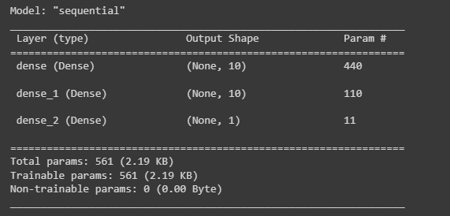

# Deep learning challenge

# Project overview

The purpose of this analysis and model is to accurately predict the best candidates for funding based on historical data of the success of past ventures when funded, the model returns a binary classification, either is a viable option or not.

# Data Preprocessing

* What variable(s) are the target(s) for your model?
"IS_SUCCESSFUL" is the target for the model since it will say whether the venture is succesful or not.

* What variable(s) are the features for your model?
The remaining columns except "EIN" and "NAME".

* What variable(s) should be removed from the input data because they are neither targets nor features?
"EIN" and "NAME"

# Compiling, Training, and Evaluating the Model

* How many neurons, layers, and activation functions did you select for your neural network model, and why?

* Were you able to achieve the target model performance?
The model only achieved a 73% of accuracy using the test dataset.

* What steps did you take in your attempts to increase model performance?
Changing activation functions, adding layers, increasing the node count, also, modifying the epochs count.

# Summary
Neither of the models achieved an accuracy value above 75%, the highest score was 73%, it is possible that resampling the data could increase the accuracy, but as fat as this analysis goes the number of neurons, layers or different activation functions affected positively the result.
